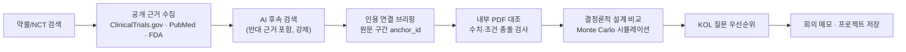

# TrialBoard

**임상 근거부터 설계 검토까지 — 증거를 연결하고, KOL과의 다음 결정을 준비하는 Agent**

[](https://github.com/Chan-gyuLee/trialboard/actions/workflows/ci.yml)


> 제4회 JUMP AI 경진대회 출품작 · **대전곡사포팀** (이찬규, 이률)

---

## 한 줄 소개

표적항암제 등 신약의 **용량 비교시험 설계**를 준비할 때, 공개 근거를 모으고 → 내부 자료와 대조하고 →
결정론적으로 설계를 비교하고 → KOL(Key Opinion Leader) 회의에서 물어야 할 질문까지 정리해주는
**근거 기반 설계 검토 워크스페이스**입니다.

AI가 잘하는 일(자료 정리·대조·검증)과 못하는 일(신규 후보물질 외삽, 숫자 계산)을 분리하는 것이
이 프로젝트의 핵심 설계 원칙입니다. 숫자 계산은 NumPy/SciPy 결정론적 엔진이 전담하고,
LLM은 "검토가 필요한 쟁점을 찾고 사람이 판단할 근거를 준비하는" 역할만 맡습니다.

> ⚠️ **본 프로젝트는 연구용 프로토타입입니다.** 임상적 의사결정, 규제 승인, 권장 용량을 제공하지 않으며
> 모든 AI 출력은 전문가 검토가 필요한 가설(hypothesis)로 취급됩니다. 자세한 내용은 [한계와 책임](#한계와-책임) 참고.

---

## 왜 TrialBoard인가

| | 근거 |
|---|---|
| **AI는 외삽에 약하다** | 자연 단백질/기존 화학 공간 위주로 학습된 모델은 새로운 화학종·신규 후보물질에 일반화하지 못한다 (Generative AI for drug discovery, ScienceDirect 2025 등) |
| **AI는 정리·대조·검증에 강하다** | TrialMind는 임상 근거 추출에서 GPT-4 대비 정확도 16~32% 향상, 사람+AI 협업 시 스크리닝 시간 44.2% 단축을 보였다 (Nature npj Digital Medicine, 2025) |
| **KOL 자문은 비용이 크다** | 전문가 자문은 시간당 200파운드 이상, 연 2만5천 달러 이상의 자문료가 발생한다 (PMC 2432185) |

그래서 TrialBoard는 **새 분자를 설계하거나 후보물질을 발굴하지 않습니다.** 대신 자료 조사 → 정리 → 대조 →
설계안 검증까지 자동화해, 사람은 **마지막 고위험 판단과 승인**에만 집중할 수 있도록 돕습니다.

---

## 핵심 흐름



| 단계 | 구현 | 사람이 하는 일 |
|---|---|---|
| 공개 근거 조사 | CT.gov/PubMed/FDA 교차 수집, AI가 반대 근거(CONTRARIAN) 검색어를 **강제로** 포함 | 수집 범위·우선순위 확인 |
| 근거 검토 | 원문 구간(anchor_id) 단위 인용, 부족 근거는 `INSUFFICIENT_EVIDENCE`로 보류 | 쟁점 원문 직접 대조 |
| 수치 분석 | 정규식+Decimal 기반 결정론적 검증, 조건 충돌은 LLM이 "합리적 불일치 vs 진짜 충돌" 2차 분류 | 최종 판단 |
| 설계 비교 | NumPy PCG64 고정시드 Monte Carlo, 표본수/가정별 선택확률·오선택률 계산 | 가정값 확정 |
| KOL 준비 | 규칙 기반 우선순위 + LLM 2차 의견, 회의 메모 Markdown/JSON 저장 | 질문 선정·회의 진행 |

---

## 기능 하이라이트

<details open>
<summary><b>이번 라운드에서 새로 구현/보강한 9가지</b> (클릭하여 펼치기/접기)</summary>

| 기능 | 설명 | 코드 |
|---|---|---|
| 🈯 한영 임상 용어사전 | ~970개 임상/약리/통계/종양학 용어쌍. 한글 약물명·적응증 검색 시 영문 검색어를 자동 병행 | `trialboard/research/glossary.py` |
| 🔢 Tabular 모델 참고값 | TabPFN 기반 용량-반응 외삽 추정치 (라이선스 미설정 시 자동으로 `UNAVAILABLE` 저하) | `trialboard/review/tabular_model.py` |
| ⚖️ 불일치 2차 분류 | 충돌하는 수치가 "조건차이(중간/최종분석 등)로 인한 합리적 불일치"인지 LLM이 2차 의견 제시. 원 데이터 제외 로직은 그대로 유지 | `trialboard/review/conflict_classifier.py` |
| 💊 신규 용량 제안 pass-through | 문헌에 이미 쓰여있는 신규 용량 추천을 AI가 그대로 인용·전달 (지어낸 외삽 금지, 인용 ID 검증) | `trialboard/agent/design_proposal.py` |
| 🔗 동일 시험 병합 판단 | 인용문이 원문에 실제로 존재할 때만 "같은 임상시험"으로 판단 (fail-closed) | `trialboard/research/trial_merge.py` |
| 🔁 수집 재시도 큐 | 실패/제한된 수집을 큐에 적재, 최대 3회 재시도 후 사람 개입 요청으로 승격 | `trialboard/research/retry_queue.py` |
| 🗂️ 카드 칸반 보드 | 저장된 프로젝트를 "검토 가능 / 확인 필요 / 접근 제한" 3열 카드로 시각화 | `web/src/ProjectKanbanBoard.tsx` |
| 👤 사용자별 캐시 | 같은 질의도 사용자마다 독립된 캐시 슬롯 (TTL·엔트리 캡 포함) | `trialboard/user_cache.py` |
| 📋 KOL 우선순위 2차 의견 | 규칙 기반 긴급도 점수에 더해 LLM이 독립적인 우선순위 의견 제시 | `trialboard/agent/kol_priority.py` |

모든 LLM 연동은 동일한 원칙을 따릅니다 — **모델 호출이 실패해도 기능 자체는 막히지 않고 빈 결과로 저하**되며,
**인용은 항상 원문 문자열과 대조해 검증**하고, **최종 판단은 사람이** 합니다.
</details>

### 🧱 기존 핵심 기능

<table>
<tr><td width="34"><h3>🚪</h3></td><td><b>자동 검토 진입</b><br/>입력 하나 · 동의 한 번으로 시작. 실제 작업 이벤트, 부분 실패, 저장 결과 복귀까지 지원<br/><sub>⚠️ 설계 자동 생성까지 완전 자동화는 아님</sub></td></tr>
<tr><td><h3>💊</h3></td><td><b>약물 검색 · 근거 DB</b><br/>ClinicalTrials.gov 검색, Europe PMC/PubMed · FDA 연결 수집, AI 조사 계획 → 후속 검색 → 인용 검토<br/><sub>⚠️ 논문은 주로 초록/서지이며 전문 전체 자동 확보는 아님</sub></td></tr>
<tr><td><h3>📄</h3></td><td><b>PDF 원문 검토</b><br/>텍스트 · 페이지 · 위치 · 파일 지문 대조, 문구 후보와 주변 문맥 선택<br/><sub>⚠️ 텍스트 PDF 5MB/40페이지 이내, OCR 미지원</sub></td></tr>
<tr><td><h3>🧮</h3></td><td><b>수치 · 필드 검토</b><br/>확인/수정/보류 이력 관리, 시험 · 환자군 · 시점 대조, JSON 복구<br/><sub>⚠️ 임상적 동일성을 자동 승인하지는 않음</sub></td></tr>
<tr><td><h3>🧪</h3></td><td><b>설계 비교 · KOL</b><br/>2–4개 표본수 대안, 고정 균등배정 Monte Carlo 비교, KOL 질문 · 메모 관리<br/><sub>⚠️ 최적 용량 · 검정력 계산이 아닌 가상 모수 실험</sub></td></tr>
<tr><td><h3>👥</h3></td><td><b>팀 · 권한</b><br/>로그인/세션/역할(admin · reviewer · viewer), 프로젝트 ACL, 이용조건(원문보관/내부검색/외부AI/학습) 4분류 관리<br/><sub>⚠️ 현재 HTTP 루프백 전용, 운영 SSO/TLS 미구성</sub></td></tr>
<tr><td><h3>💾</h3></td><td><b>프로젝트 · 복구</b><br/>PDF · 필드 이력 · 설계 초안 · 회의 기록을 로컬 SQLite에 버전 저장/복구<br/><sub>⚠️ 클라우드 동기화는 아님</sub></td></tr>
</table>

---

## 빠른 시작

### 준비물

- **Python 3.12**, [uv](https://docs.astral.sh/uv/getting-started/installation/)
- **Node.js 24.x**, npm
- (선택) [TabPFN](https://github.com/PriorLabs/TabPFN) 라이선스 토큰 — 없어도 나머지 기능은 모두 동작합니다

### 설치 및 실행

```bash
git clone https://github.com/Chan-gyuLee/trialboard.git
cd trialboard

# 백엔드 의존성
uv sync --locked --group dev

# 프런트엔드 의존성
npm --prefix web ci
```

**터미널 1 — API 서버**

```bash
uv run python -m trialboard.api \
  --enable-designs --enable-agent-demo --enable-pdf-agent --enable-evidence-scout
```

서버를 켜는 것만으로 모델을 호출하지 않습니다. 실제 모델 실행에는 화면에서 별도 동의가 필요합니다.

**터미널 2 — 웹 화면**

```bash
npm --prefix web run dev
```

브라우저에서 **http://127.0.0.1:5173** 을 엽니다. API는 http://127.0.0.1:8000 (`/docs`에서 OpenAPI 확인 가능).

### 처음 눌러볼 곳 — 키 없이 체험

1. 첫 화면 **보유 자료로 검토** → **합성 사례로 시작**
2. **차이 확인 · 원자료 기준 가상 비교**에서 로컬 Monte Carlo 계산 실행
3. 가정을 전환하며 설계안 비교, **KOL 회의 브리핑** 탭에서 질문 확인

이 경로는 모델 키 없이 동작하는 합성(MOC) 사례이며, 공개 약물 근거로 생성된 설계가 아닙니다.
실제 AI 조사를 쓰려면 경진대회 API 키를 입력하거나 `--agent-provider codex`로 개인 ChatGPT 로그인을 사용하세요.

---

## 테스트 · 빌드

```bash
# 백엔드
uv run ruff check trialboard tests
uv run pytest

# 프런트엔드
npx --prefix web tsc --noEmit
node --test web/tests/*.test.mjs
npm --prefix web run build
```

최신 검증 결과: **Python 1125 passed / 5 skipped** · **웹 1127 passed / 4 skipped** · Ruff·TypeScript·Vite 빌드 통과.
(건너뛴 테스트는 로컬 전용 참고 PDF가 없어 생략된 것입니다.)

---

## 기술 구성

| 영역 | 스택 |
|---|---|
| 백엔드 | Python 3.12 · FastAPI · Pydantic v2 · NumPy/SciPy (결정론적 시뮬레이션) · TabPFN (선택) · SQLite |
| 프런트엔드 | React 19 · TypeScript · MUI · Vite · PDF.js |
| AI 제공자 | 대회 API(Dacon) 기본, 개인 Codex 로그인 선택 가능. 서버 Secret로만 키 주입, 프런트/Git에 키 저장 금지 |
| 테스트 | pytest (Python), `node --test` (TypeScript, Node 24 네이티브 strip-types) |

```
trialboard/
├─ trialboard/          # Python 백엔드
│  ├─ agent/            # LLM 기반 추출·검증·설계 제안
│  ├─ research/         # 근거 수집·조사·용어사전·재시도 큐
│  ├─ review/           # 결정론적 설계 비교 엔진 + 충돌 분류기
│  └─ api/              # FastAPI 라우트
├─ web/                 # React 프런트엔드
│  └─ src/
├─ tests/               # pytest
└─ docs/                # 기능별 계약·정책 문서
```

---

## 한계와 책임

- **임상 승인·권장 용량이 아닙니다.** 모든 AI 출력은 `AI HYPOTHESIS` 또는 `PARTIAL_ABSTENTION`으로 표시되며 전문가 검토 전제입니다.
- **인용은 항상 원문과 문자열 단위로 대조**합니다. 다만 "인용된 문구가 주장을 의미적으로 뒷받침하는가"는 좁은 규칙(무작위배정 모순 등) 검사이며, 일반적인 의미함의(entailment) 검증은 아닙니다.
- **결정론적 계산(Monte Carlo)과 LLM 해석은 분리**되어 있으며, 숫자는 NumPy/SciPy만 생성합니다.
- 설계 비교는 고정 표본수·균등배정 가정 실험이며, 검정력 계산이나 실제 최적 용량 추정이 아닙니다.
- 현재 TEAM 모드는 HTTP 루프백 전용이며, 운영 환경 SSO/TLS 구성이 필요합니다.
- OCR 미지원 (이미지 PDF/표 자동 추출 불가), 텍스트 PDF도 5MB/40페이지 제한이 있습니다.

전체 제안서 기준 진행률은 주관적 추정치이며 테스트 통과율·임상 정확도와 다릅니다. 기능별 세부 계약·정책은 [`docs/`](docs)를 참고하세요.

---

## 팀

**대전곡사포팀** · 제4회 JUMP AI 경진대회

- **이찬규** — KAIST 전산학부. AI/생명과학 교차 연구(de novo protein design), 2025 KAIST 올해의 졸업생상·대한민국 인재상
- **이률** — 개발자. 광학 연구로 삼성휴먼테크논문대회 금상, 다수 창업·알고리즘 개발 경험

2016년 세종영재학교 입학 이래 함께 프로젝트를 이어온 팀입니다.

---

## 라이선스

별도 라이선스를 명시하지 않은 모든 권리는 저자에게 있습니다 (All rights reserved).
문의는 GitHub Issue 또는 팀 연락처로 부탁드립니다.
