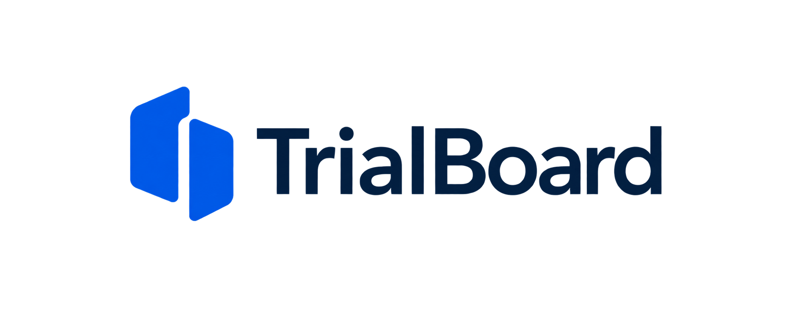

# TrialBoard logo concept v1



상태: 미채택 탐색안. 사용자 피드백은 “로고 별론데? 다른거”였습니다. 최종 로고로 사용하지 않습니다.
사이트에는 적용하지 않았으며 벡터 원본·상표 유사성 검토는 미완료입니다.

생성: 내장 image_gen 도구 (CLI 사용 안 함).

## 최종 생성 프롬프트

```text
Use case: logo-brand
Asset type: original logo concept for TrialBoard, a professional clinical-trial evidence-review workspace used by biotech development teams.
Create one exceptionally refined, original visual identity: a compact symbol plus the exact wordmark "TrialBoard". It should look commissioned from a thoughtful identity designer: quiet, clear, intelligent, enduring, not a generic AI startup logo.
Concept: evidence placed side by side, aligned and made traceable. Explore a distinctive simple geometric symbol composed of two related solid forms with a precise shared alignment or negative-space relationship; a subtle T/B reference is welcome only if genuinely elegant. The mark must have a strong silhouette, very few parts, and feel usable as a 20px product icon. No intricate details or generic rounded-square app badge.
Typography: beautifully optically spaced contemporary humanist/neo-grotesque sans serif, medium weight, exact mixed case TrialBoard. Avoid futuristic lettering, excessively round cartoon letters, and heavy corporate bold. Symbol and wordmark must feel designed together.
Composition: one horizontal primary logo centered on a pure white landscape canvas, ample clean negative space. Symbol on the left and wordmark on the right, balanced optical alignment. Only one logo lockup, not a mood board, not a collage, no additional text.
Colors: restrained ink-navy wordmark and deep clear blue symbol, compatible with a white clinical review workspace. Flat solid colors. The symbol must also work in one color.
Constraints: clean vector-like edges, no gradients, no shadows, no 3D, no mockup objects, no paper textures, no grid lines, no slogan, no watermark. No flasks, DNA helices, molecules, medical crosses, shields, checkmarks, AI sparkles, neural-network nodes, or imitation of an existing technology-company logo.
```
