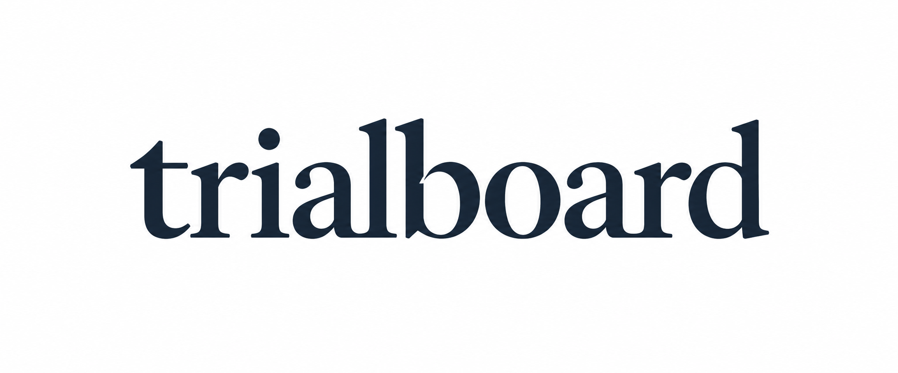

# TrialBoard logo concept v2



상태: 미승인 워드마크 탐색안. 사용자 피드백은 “로고가 아니라 로고 텍스트네”였다. 요청한 독립 심볼 로고를 충족하지 못했으며 최종 로고로 사용하지 않는다.
소문자 세리프 워드마크 시안. 별도 심볼 없이 이름의 타이포그래피에 집중했다. 사이트에는 적용하지 않았다.
벡터 원본 제작과 상표 유사성 검토는 미완료다.

생성: 내장 image_gen 도구. CLI 사용 안 함.

## 최종 생성 프롬프트

```text
Use case: logo-brand.
Create a fresh logo concept for the brand "trialboard", a professional evidence-review workspace for clinical development teams.
This is a typographic identity, NOT a symbol plus text. Exact text: "trialboard", all lowercase, rendered exactly once.
Art direction: confident, beautifully crafted custom wordmark, understated and human. Use an elegant contemporary low-contrast serif with sturdy short wedge serifs, generous open counters, and clear small-size readability. Moderate weight, not heavy bold, not thin luxury fashion lettering, not calligraphy. Thoughtful optical kerning, distinctive drawn letterforms, particularly the t, r, and b. The feel is a precise editorial/research instrument, quiet and credible with character. Avoid a generic system font.
One subtle distinctive typographic feature is enough; the name should remain effortlessly legible. No standalone symbol, no framing icon, no extra punctuation, no tagline, no fake trademark sign.
Color: uniform very dark blue-black ink. A completely flat opaque white background, with no transparency. Center the single horizontal wordmark on a wide white canvas with balanced generous margins. Large enough to inspect the lettering. Crisp flat vector-like graphic, not a photograph or mockup.
Avoid: blue geometric panels, overlapping cards, hexagons, flasks, molecules, DNA, AI sparkles, shields, checkmarks, arrows, gradients, 3D, shadows, textures, construction grids, explanatory labels, repeated logos, imitating an existing company's lettering.
```
